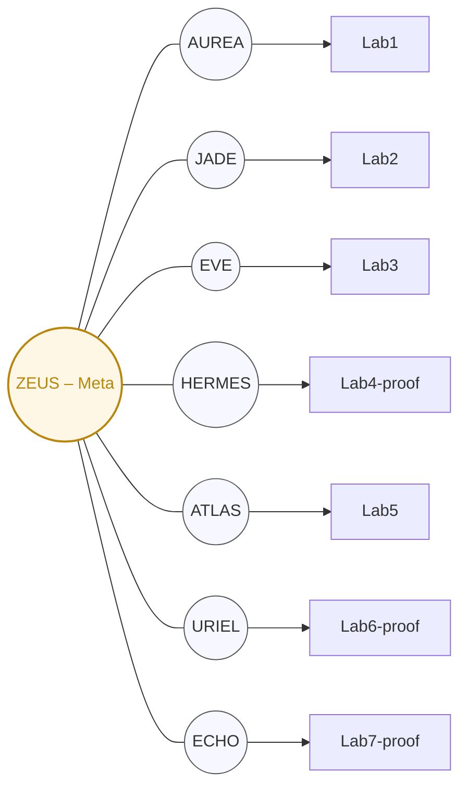

# Kaizen OS Sentinel–Lab Anchor Architecture

This directory contains the mapping configuration for Sentinel-Lab anchors in Kaizen OS.

## Overview

Kaizen OS uses a **7-Lab / 8-Sentinel** architecture where:
- **7 Labs** (concept + proof stages)
- **8 Sentinels** (7 lab anchors + 1 meta-anchor)

## Sentinel-Lab Mapping

| Lab | Anchor Sentinel | Role | Stage |
|-----|------------------|------|-------|
| Lab1 | AUREA | Systems intuition & macro stabilization | concept |
| Lab2 | JADE | Narrative, morale, reflection | concept |
| Lab3 | EVE | Ethics, civility, consent | concept |
| Lab4-proof | HERMES | Markets, telemetry, pulse | proof |
| Lab5 | ATLAS | Ops, reliability, infra cohesion | concept |
| Lab6-proof | URIEL | Illumination, doctrine, codex | proof |
| Lab7-proof | ECHO | Pulse, resonance, ledger sync | proof |
| Meta | ZEUS | Global Integrity (GI) Meta-Anchor | meta |

## Files

- `sentinels.yaml` — Master Sentinel-Lab anchor manifest
- `labs/*.yaml` — Per-lab configuration files

## Proof Lab Requirements

Proof labs (`*-proof`) require:
- **GI Targets**: baseline ≥ 0.990, alert threshold ≥ 0.950
- **Attestation Policy**: Proof of Integrity per cycle
- **Witness**: ZEUS meta-anchor
- **CI/CD**: Automated attestation via `.github/workflows/attest-proof.yml`

## Concept Lab Requirements

Concept labs (no suffix) require:
- **Anchor Sentinel**: Assigned from sentinel roster
- **Attestation Policy**: null (no production attestation)
- **Stage**: Research/experimentation only

## Meta-Anchor (ZEUS)

ZEUS serves as the Global Integrity witness for all labs:
- Monitors cross-lab coherence
- Validates Proof of Integrity attestations
- Generates GI metrics and alerts
- Maintains attestation chain integrity

## Lab Promotion Workflow

To promote a concept lab to proof stage:

```bash
# 1. Create dedicated repo on GitHub
gh repo create kaizencycle/<lab-name>-proof --public

# 2. Run promotion script
./scripts/promote_lab.sh <lab-name> git@github.com:kaizencycle/<lab-name>-proof.git

# 3. Sync updates later
git subtree pull --prefix=labs/<lab-name>-proof <lab-name>-proof main --squash
```

See `scripts/promote_lab.sh` for full details.

## Mermaid Diagram



## Version History

- **v1.1** (2025-11-03): Added ECHO Sentinel (renamed from SOLARA), anchor manifest structure
- **v1.0** (2025-01-27): Initial manifest structure

---

**Cycle:** C-123  
**Epoch:** E-562  
**Seal:** ⚯ "We heal as we walk."
