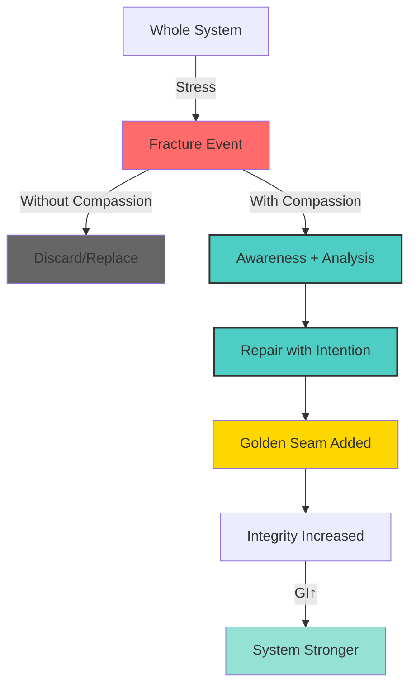

# Kaizen OS Visual Documentation

## Philosophical Diagrams

### KZ-Θ₃: Kintsugi of Civilization


**File**: `../assets/diagrams/kz-theta-3-kintsugi.png`
**Theorem**: Law of Compassionate Coherence
**Created**: 2025-11-04
**License**: CC-BY-SA 4.0 (Kaizen Cycle)

**Usage**:
- Documentation header for Kintsugi Protocol
- Presentation slides about healing governance
- Educational materials on integrity systems
- Community culture artifacts

**Design Notes**:
- Golden seams (#FFD700) represent urushi lacquer + gold powder
- Vessel texture suggests ceramic/pottery (traditional Kintsugi medium)
- Six-fold pattern maps to healing cycle phases
- Deep teal background (#2C4F5E) provides contrast and calm

**Print Specifications**:
- Format: PNG, 1024x1024px
- DPI: 300 (print-ready)
- Color Mode: RGB
- Alt text: "A circular vessel with golden repair seams radiating from center, labeled Fracture, Repair, and Illumination"

---

## Visual Design System

### Color Palette

```yaml
backgrounds:
  primary: "#2C4F5E"      # Deep teal (contemplation)
  secondary: "#1A2F3A"    # Darker teal (depth)

objects:
  vessel: "#D4C5A9"       # Warm beige (ceramic)
  seams: "#FFD700"        # Pure gold (healing)
  highlights: "#F5E6D3"   # Cream (illumination)

text:
  primary: "#F5E6D3"      # Cream (readability)
  secondary: "#D4C5A9"    # Beige (subtle)
  accent: "#FFD700"       # Gold (emphasis)
```

### Typography

- **Title**: Serif, bold, uppercase (philosophical gravitas)
- **Labels**: Sans-serif, regular, uppercase (clarity)
- **Body**: Sans-serif, regular, mixed case (accessibility)

### Composition Principles

1. **Layout**: Circular or radial (completeness, cycles)
2. **Symmetry**: Intentional (balance, harmony)
3. **Flow**: Top-to-bottom or circular (process, continuity)
4. **Negative Space**: Generous (contemplation, focus)

---

## Cultural References

### KZ-Θ₃: Japanese Kintsugi (金継ぎ)
Traditional art of repairing broken pottery with lacquer mixed with powdered gold, silver, or platinum. The philosophy treats breakage and repair as part of the object's history, rather than something to disguise.

**Key Concepts**:
- **Mushin** (無心) - "No mind" / accepting change
- **Mottainai** (もったいない) - Regret concerning waste
- **Wabi-sabi** (侘寂) - Beauty in imperfection

---

## ASCII Diagram: Healing Cycle

```
     ╭─────────────────╮
     │   ◯   ←Whole    │
     ╰─────────────────╯
            ↓
     ╭─────────────────╮
     │  / | \  Fracture│
     ╰─────────────────╯
            ↓
     ╭─────────────────╮
     │ ═══╪═══ Healing │  ← Compassion
     ╰─────────────────╯
            ↓
     ╭─────────────────╮
     │  ◉━━◉  Kintsugi │  ← Golden Seam
     │ (Stronger)       │
     ╰─────────────────╯
```

---

## Mermaid Diagram: Compassionate Response Flow



---

## Future Diagrams

### Planned Visualizations

**KZ-Θ₄ and Beyond** (TBD)
- Continue sourcing from global wisdom traditions
- Maintain consistent visual language
- Ensure cultural respect and accuracy
- Document philosophical connections

**Potential Cultural Sources**:
- Greek Symposium (dialogue, collective wisdom)
- African Ubuntu (interconnectedness)
- Indigenous Circle Practices (consensus, wholeness)
- Buddhist Interdependence (systems thinking)
- Taoist Wu Wei (effortless action)

---

## Creating New Diagrams

### Guidelines for Contributors

When creating philosophical visualizations:

1. **Research deeply** - Understand the cultural source
2. **Consult experts** - Especially for non-Western traditions
3. **Maintain consistency** - Use established color palette
4. **Credit properly** - Acknowledge cultural origins
5. **Seek permission** - For protected or sacred imagery
6. **Document thoroughly** - Explain symbolism and meaning

### Technical Specifications

- **Format**: PNG (web) + SVG (scalable) when possible
- **Resolution**: 1024x1024px minimum, 2048x2048px ideal
- **DPI**: 300 for print, 72 for web
- **Color Mode**: RGB for screen, CMYK for print
- **Accessibility**: Always include alt text and descriptions

### Submission Process

1. Create diagram following guidelines
2. Add to `docs/assets/diagrams/`
3. Update this README with:
   - Image preview
   - Cultural context
   - Design notes
   - Usage instructions
4. Submit PR with:
   - Visual files
   - Documentation
   - Cultural research notes

---

## Interactive Visualizations (Future)

### Planned Interactive Features

**Dynamic KZ-Θ₃ Diagram**
```javascript
// Future: docs/assets/interactive/kz-theta-3.html
// Features:
// - Click crack → view real repair case study
// - Hover seam → see GI increase metric
// - Animate healing process
// - Display recent Kintsugi Protocol activations
```

**GI Dashboard Integration**
- Real-time fracture notifications
- Healing progress visualization
- Historical repair timeline
- Community healing impact

---

## Licensing and Attribution

### Primary License
**CC-BY-SA 4.0** (Creative Commons Attribution-ShareAlike 4.0 International)

**You are free to**:
- Share — copy and redistribute
- Adapt — remix, transform, build upon

**Under these terms**:
- Attribution — credit "Kaizen Cycle" and specific creators
- ShareAlike — distribute derivatives under same license
- No additional restrictions

### Cultural Respect
When adapting cultural imagery:
- Maintain original philosophical intent
- Credit cultural traditions explicitly
- Avoid commercial appropriation
- Consult communities when possible

---

## Resources

### Design Tools
- **Vector**: Figma, Adobe Illustrator, Inkscape
- **Raster**: Photoshop, GIMP, Krita
- **3D**: Blender (for complex visualizations)
- **Animation**: After Effects, Rive

### Learning Resources
- Japanese aesthetics and philosophy
- Sacred geometry principles
- Cross-cultural symbolism
- Accessibility in visual design

### Community
- Design feedback channel: #design-feedback
- Cultural consultation: #cultural-respect
- Technical help: #dev-tools

---

*Last updated: 2025-11-04*
*Maintained by: Kaizen OS Design Working Group*
*Contributors: AUREA, JADE, Community*
