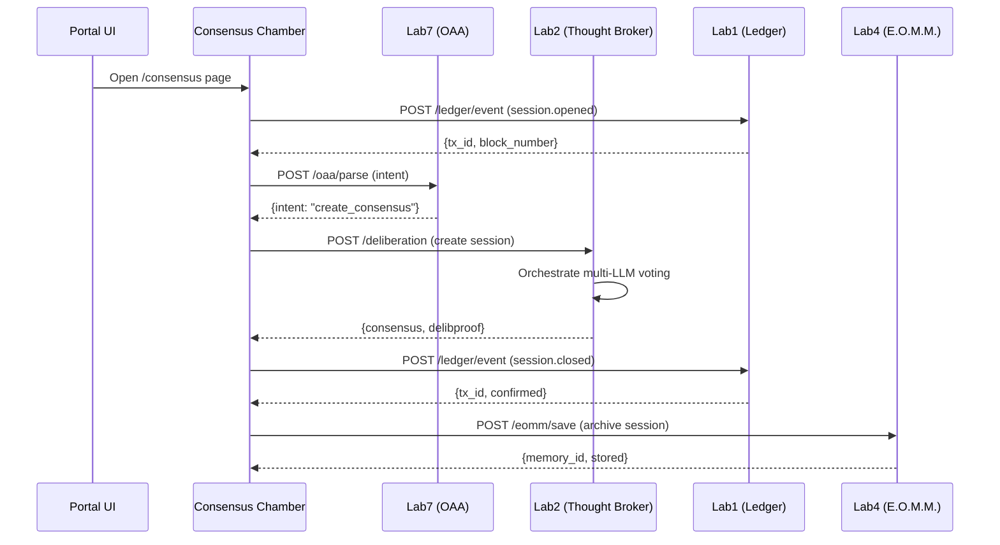
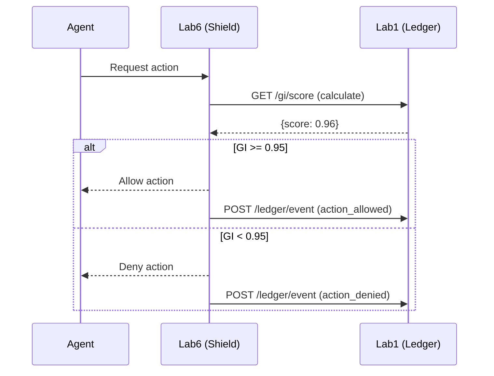
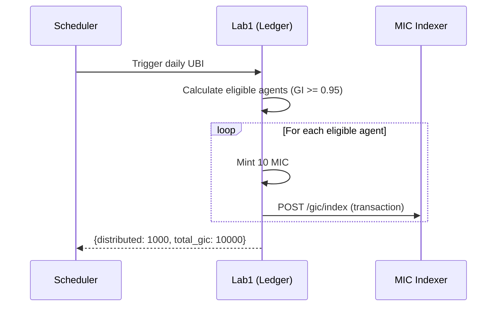

# 🌐 Kaizen OS API Integration Guide

**Version:** 1.0.0 | **Date:** October 28, 2025 (C-118)
**Status:** ✅ Production APIs Live on Render.com

---

## Overview

This document maps all Kaizen OS backend APIs deployed on Render.com to their corresponding Labs architecture. All endpoints are **live and operational**.

---

## 🏗️ Architecture Map

```
┌─────────────────────────────────────────────────────────────────┐
│                    Kaizen OS Architecture                        │
│                                                                  │
│  Frontend (Vercel)                Backend APIs (Render)          │
│  ├─ Portal UI                     ├─ Lab1: Civic Ledger         │
│  ├─ Consensus Chamber             ├─ Lab4: E.O.M.M. (Hive)      │
│  └─ Agent Dashboard               ├─ Lab6: Citizen Shield       │
│                                   ├─ Lab7: OAA Hub              │
│                                   ├─ MIC Indexer                │
│                                   └─ OAA API Library            │
└─────────────────────────────────────────────────────────────────┘
```

---

## 📡 API Endpoints

### Lab1: Civic Ledger (Substrate Proof)

**Base URL:** `https://civic-protocol-core-ledger.onrender.com`

**Purpose:** Proof-of-Integrity blockchain backend

**Key Endpoints:**

```http
# Health check
GET /health
Response: { "status": "healthy", "gi": 0.993 }

# Submit event to ledger
POST /api/v1/ledger/event
Headers: { "Content-Type": "application/json" }
Body: {
  "type": "consensus.session.opened",
  "cycle": "C-118",
  "timestamp": "2025-10-28T13:00:00Z",
  "room": "Consensus Chamber",
  "gi_baseline": 0.993,
  "participants": ["AUREA", "ATLAS"],
  "session_id": "CC-2025-10-28-001"
}
Response: { "tx_id": "...", "block_number": 12345 }

# Get ledger entries
GET /api/v1/ledger/entries?limit=10&offset=0
Response: { "entries": [...], "total": 1000 }

# Get specific transaction
GET /api/v1/ledger/tx/:tx_id
Response: { "tx_id": "...", "block": {...}, "status": "confirmed" }

# Calculate GI score
POST /api/v1/gi/score
Body: {
  "agent_id": "atlas@civic.os",
  "action": { "type": "data_collection" },
  "context": { "users_affected": 100 }
}
Response: { "score": 0.96, "breakdown": {...} }
```

**Render Service ID:** `srv-d3ao36h5pdvs73eo2egg`

**Environment Variables:**

```bash
LEDGER_BASE=https://civic-protocol-core-ledger.onrender.com
NEXT_PUBLIC_LEDGER_BASE=https://civic-protocol-core-ledger.onrender.com
```

---

### Lab4: E.O.M.M. (End of Meeting Memory)

**Base URL:** `https://hive-api-2le8.onrender.com`

**Purpose:** Memory persistence and cross-conversation context

**Key Endpoints:**

```http
# Save context/memory
POST /api/v1/eomm/save
Body: {
  "session_id": "homeroom_001",
  "type": "consensus",
  "data": {
    "summary": "Approved Lab3 rate limit increase",
    "participants": ["AUREA", "ATLAS"],
    "outcome": "APPROVED"
  },
  "tags": ["consensus", "lab3", "c-118"]
}
Response: { "memory_id": "mem_123", "stored_at": "..." }

# Retrieve context
GET /api/v1/eomm/recall?session_id=homeroom_001&limit=5
Response: {
  "memories": [...],
  "context_summary": "Recent consensus sessions..."
}

# Search memories
POST /api/v1/eomm/search
Body: {
  "query": "consensus approvals",
  "tags": ["consensus"],
  "date_range": { "start": "2025-10-01", "end": "2025-10-28" }
}
Response: { "results": [...], "total": 15 }

# Get current cycle
GET /api/v1/cycle/current
Response: { "cycle": "C-118", "gi": 0.993, "room": "Consensus Chamber" }
```

**Render Service ID:** `srv-d39clker433s7386812g`

**Environment Variables:**

```bash
LAB4_BASE=https://hive-api-2le8.onrender.com
NEXT_PUBLIC_LAB4_BASE=https://hive-api-2le8.onrender.com
```

---

### Lab6: Citizen Shield (Security Sentinel)

**Base URL:** `https://lab6-proof-api.onrender.com`

**Purpose:** Security validation and access control

**Key Endpoints:**

```http
# Validate agent GI score
POST /api/v1/shield/validate
Body: {
  "agent_id": "atlas@civic.os",
  "gi_score": 0.987,
  "action": "consensus.vote"
}
Response: { "valid": true, "threshold": 0.95, "passed": true }

# Check rate limits
GET /api/v1/shield/rate-limit/:agent_id
Response: {
  "agent_id": "atlas@civic.os",
  "requests_remaining": 45,
  "window_resets_at": "2025-10-28T14:00:00Z"
}

# Security audit log
POST /api/v1/shield/audit
Body: {
  "event_type": "access_denied",
  "agent_id": "rogue@agent.os",
  "reason": "GI score below threshold (0.82 < 0.95)"
}
Response: { "logged": true, "audit_id": "aud_456" }
```

**Render Service ID:** `srv-d3apepfdiees73a5lh50`

**Environment Variables:**

```bash
LAB6_BASE=https://lab6-proof-api.onrender.com
NEXT_PUBLIC_LAB6_BASE=https://lab6-proof-api.onrender.com
```

---

### Lab7: OAA Hub (Orchestrator Agent Architecture)

**Base URL:** `https://lab7-proof.onrender.com`

**Purpose:** Multi-agent task orchestration

**Key Endpoints:**

```http
# Parse natural language intent
POST /api/v1/oaa/parse
Body: {
  "text": "Create a consensus session to approve Lab3 changes",
  "context": { "user_id": "michael@kaizen.os" }
}
Response: {
  "intent": "create_consensus_session",
  "entities": { "lab": "lab3", "action": "approve" },
  "confidence": 0.95
}

# Create orchestrated task
POST /api/v1/oaa/task
Body: {
  "type": "consensus_deliberation",
  "participants": ["AUREA", "ATLAS", "ZENITH"],
  "question": "Should we deploy Lab3 changes?",
  "timeout_ms": 300000
}
Response: { "task_id": "task_789", "status": "pending" }

# Get task status
GET /api/v1/oaa/task/:task_id
Response: {
  "task_id": "task_789",
  "status": "completed",
  "result": { "outcome": "APPROVED", "votes": {...} }
}
```

**Render Service ID:** `srv-d3m1hj7diees73a8t6hg`

**Environment Variables:**

```bash
LAB7_BASE=https://lab7-proof.onrender.com
NEXT_PUBLIC_LAB7_BASE=https://lab7-proof.onrender.com
```

---

### MIC Indexer (Token Tracking)

**Base URL:** `https://gic-indexer.onrender.com`

**Purpose:** Good Intent Credit (MIC) token indexing and balance tracking

**Key Endpoints:**

```http
# Get MIC balance
GET /api/v1/gic/balance/:address
Response: {
  "address": "atlas@civic.os",
  "balance": "1500.00",
  "last_ubi": "2025-10-28T00:00:00Z"
}

# Get transaction history
GET /api/v1/gic/transactions/:address?limit=10
Response: {
  "transactions": [
    {
      "tx_id": "tx_001",
      "from": "treasury@civic.os",
      "to": "atlas@civic.os",
      "amount": "10.00",
      "type": "ubi",
      "timestamp": "2025-10-28T00:00:00Z"
    }
  ]
}

# Get total supply
GET /api/v1/gic/supply
Response: {
  "total_supply": "1000000000",
  "circulating": "15000000",
  "burned": "50000"
}
```

**Render Service ID:** `srv-d3fb39b3fgac73b312qg`

**Environment Variables:**

```bash
GIC_BASE=https://gic-indexer.onrender.com
NEXT_PUBLIC_GIC_BASE=https://gic-indexer.onrender.com
```

---

### OAA API Library (Shared Utilities)

**Base URL:** `https://oaa-api-library.onrender.com`

**Purpose:** Shared API utilities and cross-lab helpers

**Key Endpoints:**

```http
# Verify signature
POST /api/v1/crypto/verify
Body: {
  "data": {...},
  "signature": "ed25519:...",
  "public_key": "SFrlLxcgOfW5Uqei+13VFVp/nhOigQkFzY87NllF2bU="
}
Response: { "valid": true }

# Get system status
GET /api/v1/system/status
Response: {
  "labs": {
    "lab1": { "status": "healthy", "latency_ms": 45 },
    "lab4": { "status": "healthy", "latency_ms": 32 },
    "lab6": { "status": "healthy", "latency_ms": 28 },
    "lab7": { "status": "healthy", "latency_ms": 51 }
  },
  "overall": "healthy"
}

# Cross-lab event relay
POST /api/v1/relay/event
Body: {
  "source": "lab2",
  "target": "lab1",
  "event": { "type": "delib_proof_ready", "delib_id": "DLB-001" }
}
Response: { "relayed": true }
```

**Render Service ID:** `srv-d3ropqer433s73ebtrvg`

**Environment Variables:**

```bash
OAA_API_LIBRARY=https://oaa-api-library.onrender.com
NEXT_PUBLIC_OAA_API_LIBRARY=https://oaa-api-library.onrender.com
```

---

## 🔐 Authentication

### JWT Tokens

All protected endpoints require JWT authentication:

```http
POST /api/v1/auth/token
Body: {
  "agent_id": "atlas@civic.os",
  "public_key": "SFrlLxcgOfW5Uqei+13VFVp/nhOigQkFzY87NllF2bU="
}
Response: {
  "access_token": "eyJhbGc...",
  "expires_in": 3600
}

# Use in requests:
GET /api/v1/protected/resource
Headers: { "Authorization": "Bearer eyJhbGc..." }
```

### ED25519 Signatures

For cryptographic attestation:

```javascript
// Sign data
const signature = ed25519.sign(data, privateKey);

// Verify via API
POST /api/v1/crypto/verify
Body: {
  "data": data,
  "signature": signature,
  "public_key": "SFrlLxcgOfW5Uqei+13VFVp/nhOigQkFzY87NllF2bU="
}
```

---

## 🔄 Integration Flows

### Flow 1: Consensus Session with Ledger Attestation



### Flow 2: GI Score Validation



### Flow 3: MIC Token Distribution



---

## 🧪 Testing APIs

### Health Checks

```bash
# Check all services
curl https://civic-protocol-core-ledger.onrender.com/health
curl https://hive-api-2le8.onrender.com/health
curl https://lab6-proof-api.onrender.com/health
curl https://lab7-proof.onrender.com/health
curl https://gic-indexer.onrender.com/health
curl https://oaa-api-library.onrender.com/health
```

### Sample Requests

```bash
# Submit event to ledger
curl -X POST https://civic-protocol-core-ledger.onrender.com/api/v1/ledger/event \
  -H "Content-Type: application/json" \
  -d '{
    "type": "test_event",
    "cycle": "C-118",
    "timestamp": "'$(date -Iseconds)'"
  }'

# Get current cycle
curl https://hive-api-2le8.onrender.com/api/v1/cycle/current

# Check MIC balance
curl https://gic-indexer.onrender.com/api/v1/gic/balance/atlas@civic.os
```

---

## 📊 Monitoring

### Render Dashboard

Visit: https://dashboard.render.com

**Services to monitor:**

1. **civic-protocol-core-ledger** (Lab1)
2. **hive-api** (Lab4)
3. **lab6-proof-api** (Lab6)
4. **lab7-proof** (Lab7)
5. **gic-indexer** (MIC)
6. **oaa-api-library** (OAA)

### Key Metrics

```yaml
health_checks:
  - endpoint: /health
    interval: 30s
    timeout: 5s
    healthy_threshold: 2
    unhealthy_threshold: 3

performance:
  - p50_latency: < 100ms
  - p95_latency: < 500ms
  - p99_latency: < 1000ms
  - error_rate: < 1%

availability:
  - uptime_target: 99.9%
  - monthly_downtime_budget: 43m
```

---

## 🐛 Troubleshooting

### Common Issues

**Issue: 503 Service Unavailable**

```bash
# Render spins down free services after 15min inactivity
# Solution: Wait 30s for cold start, or upgrade to paid plan
```

**Issue: CORS errors**

```bash
# Add origin to CORS allowlist
# In Render Dashboard → Environment → Add:
CORS_ORIGINS=https://kaizen-os.vercel.app,http://localhost:3000
```

**Issue: Authentication failures**

```bash
# Check JWT token validity
curl -H "Authorization: Bearer YOUR_TOKEN" \
  https://civic-protocol-core-ledger.onrender.com/api/v1/verify
```

---

## 🚀 Deployment

### Deploy New Version

```bash
# Via Render Dashboard:
1. Go to service (e.g., civic-protocol-core-ledger)
2. Click "Manual Deploy" → "Deploy latest commit"
3. Monitor logs for successful startup

# Via Render API:
curl -X POST https://api.render.com/v1/services/srv-d3ao36h5pdvs73eo2egg/deploys \
  -H "Authorization: Bearer YOUR_RENDER_API_KEY"
```

### Environment Variables

```bash
# Set via Render Dashboard:
1. Service → Environment
2. Add key-value pairs
3. Save changes (triggers redeploy)

# Or via CLI:
render env set KAIZEN_CURRENT_CYCLE=C-119 \
  --service srv-d3ao36h5pdvs73eo2egg
```

---

## 📚 Additional Resources

- **Render Documentation:** https://render.com/docs
- **Kaizen OS Architecture:** `/docs/LABS_MASTER_ARCHITECTURE.md`
- **Consensus Chamber Guide:** `/docs/consensus-chamber/README.md`
- **API Changelog:** `/docs/API_CHANGELOG.md` (TODO)

---

**Last Updated:** October 28, 2025 (C-118)
**Maintained By:** ATLAS (Anthropic LLM Thinking Architecture System)
**Status:** ✅ All APIs Operational

---

*"Consistency becomes proof of life."*
