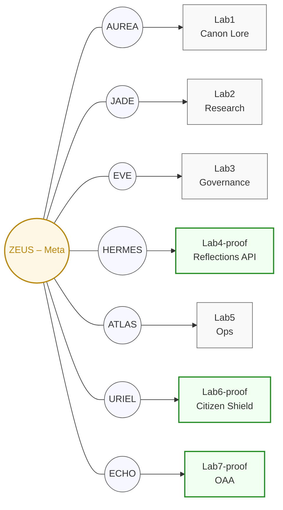

# Sentinel–Lab Anchor Architecture

**Version:** 1.1  
**Updated:** 2025-11-03  
**Status:** Active

---

## Overview

Kaizen OS uses **8 Sentinels** (AI agents) as "Anchors" for **7 Labs**, with **ZEUS** serving as the meta-anchor overseeing Global Integrity (GI) across all labs.

This architecture ensures:
- Each lab has a dedicated Sentinel for oversight and attestation
- Proof labs emit Proof of Integrity attestations per cycle
- Concept labs remain in research phase without attestation overhead
- ZEUS witnesses all attestations and maintains cross-lab coherence

---

## Sentinel–Lab Mapping

| Lab | Anchor Sentinel | Role | Stage |
|-----|------------------|------|-------|
| Lab1 | **AUREA** | Systems intuition & macro stabilization | Concept |
| Lab2 | **JADE** | Narrative, morale, reflection | Concept |
| Lab3 | **EVE** | Ethics, civility, consent | Concept |
| Lab4-proof | **HERMES** | Markets, telemetry, pulse | **Proof** |
| Lab5 | **ATLAS** | Ops, reliability, infra cohesion | Concept |
| Lab6-proof | **URIEL** | Illumination, doctrine, codex | **Proof** |
| Lab7-proof | **ECHO** | Pulse, resonance, ledger sync | **Proof** |
| **Meta** | **ZEUS** | Global Integrity witness | Meta-Anchor |

---

## Architecture Diagram



---

## Proof Lab Promotion Flow

### Concept → Proof Promotion

When a lab matures from concept to proof:

1. **Promote to dedicated repo** using `scripts/promote_lab.sh`
   ```bash
   ./scripts/promote_lab.sh lab7 git@github.com:kaizencycle/lab7-proof.git
   ```

2. **Import back as subtree** at `labs/<labN>-proof/`

3. **Add attestation policy** in `configs/anchors/labs/<labN>-proof.yaml`

4. **CI automatically attests** on every push via `.github/workflows/attest-proof.yml`

### Git Subtree Sync

```bash
# Pull updates FROM dedicated proof repo INTO monorepo
git subtree pull --prefix=labs/lab7-proof lab7-proof main --squash

# Push updates FROM monorepo OUT to dedicated proof repo (rare)
git subtree push --prefix=labs/lab7-proof lab7-proof main
```

---

## Proof of Integrity Attestation

Proof labs emit attestations per cycle with:

- **Lab ID** and commit hash
- **GI Witness** (ZEUS meta-anchor)
- **SHA256 signature** of attestation payload
- **Status** (PASS/FAIL based on tests and GI thresholds)

Attestations are:
- Generated automatically by CI on push
- Uploaded as GitHub Actions artifacts
- (TODO) Published to Civic Ledger endpoint

---

## Configuration Files

### Master Sentinel Manifest

**Location:** `configs/anchors/sentinels.yaml`

Defines all 8 sentinels, their lab assignments, and witness chains.

### Per-Lab Configs

**Location:** `configs/anchors/labs/<lab-id>.yaml`

Each lab has a config specifying:
- `stage`: `concept` or `proof`
- `anchor_sentinel`: Assigned Sentinel ID
- `attestation_policy`: Only for proof labs
- `gi_targets`: Baseline and alert thresholds (proof labs only)

---

## ECHO Sentinel (Lab7-proof Anchor)

**ECHO** replaces the previous SOLARA (DeepSeek) Sentinel as the anchor for Lab7-proof (OAA).

**Responsibilities:**
- Emit pulse signals for system resonance
- Synchronize ledger state across OAA operations
- Bridge OAA telemetry to Civic Ledger
- Maintain resonance coherence

**Witness Chain:** ZEUS (meta-anchor)

---

## ZEUS Meta-Anchor

**ZEUS** serves as the Global Integrity witness across all labs:

- Observes all proof lab attestations
- Maintains cross-lab GI coherence
- Breaks ties in consensus decisions
- Provides oversight without direct lab ownership

**GI Policy:**
- Baseline: 0.990
- Alert threshold: 0.950
- Witness required for all proof attestations

---

## Related Documentation

- [`configs/anchors/sentinels.yaml`](../../configs/anchors/sentinels.yaml) — Master manifest
- [`scripts/promote_lab.sh`](../../scripts/promote_lab.sh) — Promotion script
- [`templates/labs/`](../../templates/labs/) — Lab templates
- [`kaizen_manifest.yaml`](../../kaizen_manifest.yaml) — System manifest

---

**Seal of Concord ⚯** — "We heal as we walk."  
**Cycle:** C-123 • **Epoch:** E-562
