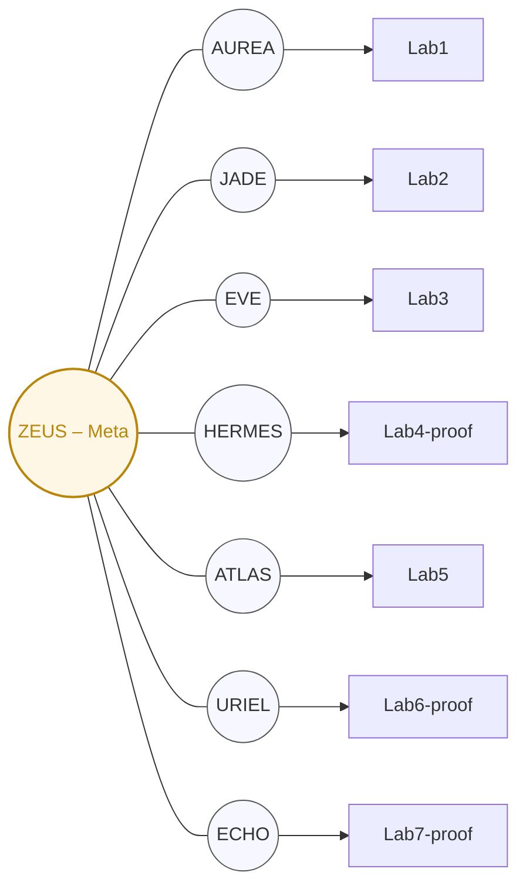

# Sentinel-Lab Anchor Architecture

## Overview

Kaizen OS uses **8 Sentinels** to anchor **7 Labs**, with ZEUS serving as the meta-anchor for Global Integrity (GI) witness across all labs.

## Sentinel-Lab Mapping

| Lab | Anchor Sentinel | Role | Stage |
|-----|------------------|------|-------|
| Lab1 | AUREA | Systems intuition & macro stabilization | Concept |
| Lab2 | JADE | Narrative, morale, reflection | Concept |
| Lab3 | EVE | Ethics, civility, consent | Concept |
| Lab4-proof | HERMES | Markets, telemetry, pulse | Proof |
| Lab5 | ATLAS | Ops, reliability, infra cohesion | Concept |
| Lab6-proof | URIEL | Illumination, doctrine, codex | Proof |
| Lab7-proof | **ECHO** | Pulse, resonance, ledger sync | Proof |
| Meta | ZEUS | Global Integrity witness (meta-anchor) | Meta |

## Architecture Diagram



## Proof Lab Promotion

Labs transition from **concept** to **proof** status via the promotion workflow:

1. **Concept Labs** (`lab1`, `lab2`, `lab3`, `lab5`):
   - Research and experimentation phase
   - No Proof of Integrity attestations required
   - Internal development

2. **Proof Labs** (`lab4-proof`, `lab6-proof`, `lab7-proof`):
   - Live services with CI/CD integration
   - Emit Proof of Integrity attestations per cycle
   - Witnessed by ZEUS meta-anchor
   - GI baseline: ≥ 0.990, alert threshold: ≥ 0.950

### Promotion Process

Use `scripts/promote_lab.sh` to promote a concept lab to proof:

```bash
./scripts/promote_lab.sh lab7 git@github.com:kaizencycle/lab7-proof.git
```

This:
1. Splits lab history into a dedicated repo
2. Imports it back as a git subtree at `labs/<lab>-proof/`
3. Configures CI/CD attestation workflow
4. Updates anchor manifest

## Configuration Files

- **Sentinel Manifest**: `configs/anchors/sentinels.yaml`
- **Lab Configs**: `configs/anchors/labs/*.yaml`
- **CI Workflow**: `.github/workflows/attest-proof.yml`
- **Promotion Script**: `scripts/promote_lab.sh`

## ECHO Sentinel (formerly SOLARA)

**ECHO** replaces SOLARA (DeepSeek) as the anchor for Lab7-proof (OAA).

- **Role**: Pulse, resonance, ledger sync
- **Provider**: DeepSeek R1
- **Capabilities**: Research, ideation, content, analysis, pulse, ledger_sync
- **Weight**: 0.7 (consensus voting)
- **Safety Tier**: Standard

ECHO handles:
- Ledger synchronization and reflection pulses
- OAA telemetry bridge to Civic Ledger
- Proof of Integrity attestations per cycle

---

*Kaizen OS Continuum • Cycle C-123 • Epoch E-562 • Seal of Concord ⚯*
