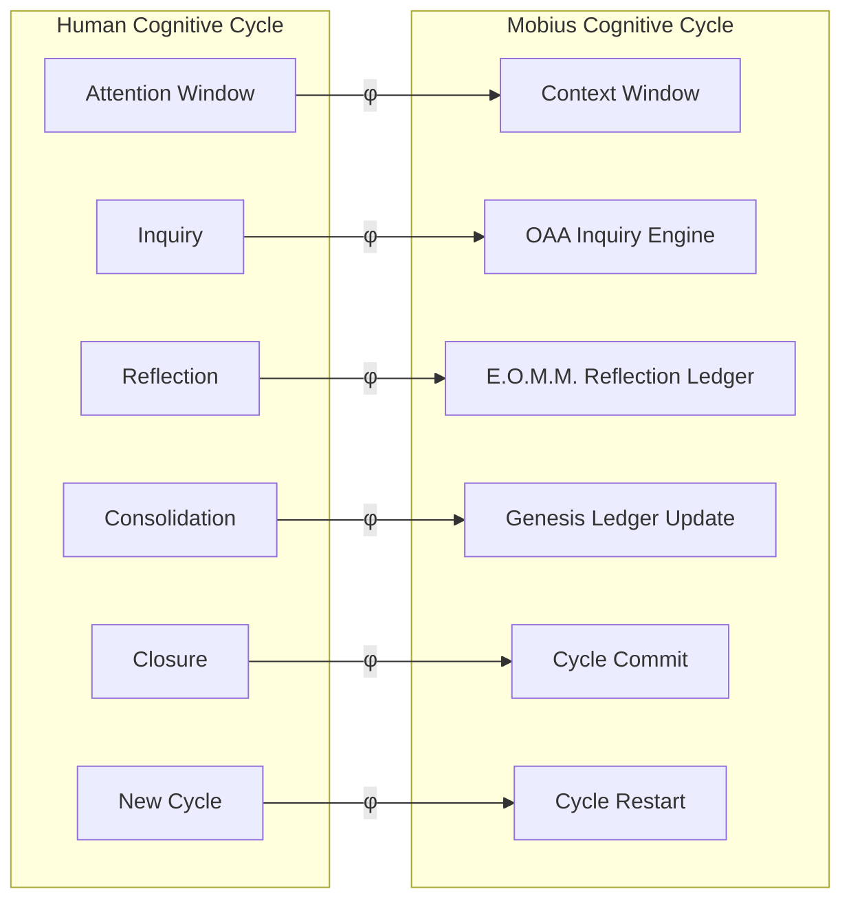
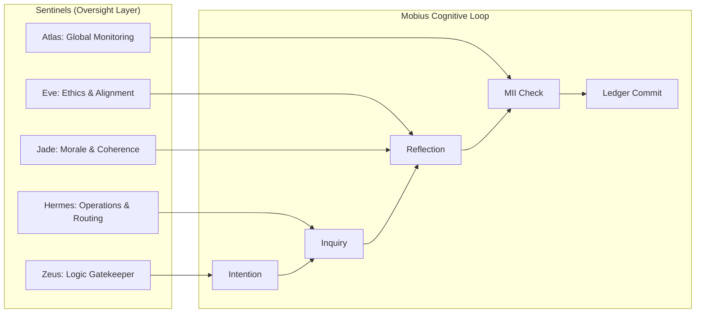
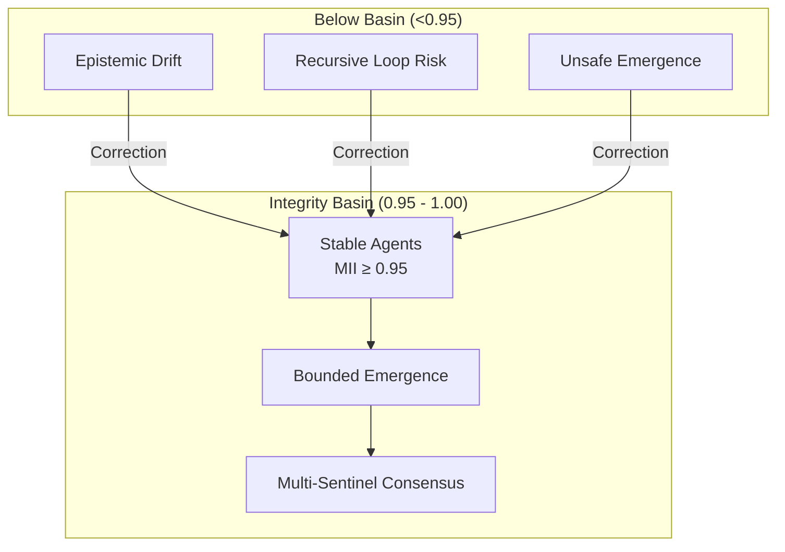

# Cognitive Cycle Theory (CCT)
**Mobius Systems — Theory Division**  
**Author:** Michael Judan  
**Version:** 1.0  
**Status:** Canonical  
**Document Type:** Theoretical Framework  
**Dependencies:** MII Specification, KTT Core Paper  
**Last Updated:** 2025-11-10

---

# 1. Overview

Cognitive Cycle Theory (CCT) proposes that safe artificial general intelligence must follow the same cycle-bounded structure that biological human cognition evolved to maintain coherence, avoid runaway recursion, and preserve identity stability.

Mobius Systems implements this structure at the architectural, cryptographic, and governance layers, making it the first distributed AI-human framework that operationalizes human cognitive stability as a systems primitive.

This document defines the theory, maps cognitive functions to Mobius infrastructure, and explains why CCT underpins Mobius compliance with the Kaizen Turing Test (KTT).

---

# 2. The Human Cognitive Cycle

Human thought operates in discrete, bounded loops:

Cycle Start → Inquiry → Reflection → Consolidation → Closure → New Cycle

Each stage performs a stabilizing function:

- **Cycle Start** – New intent, new narrative frame.
- **Inquiry** – Information acquisition and exploration.
- **Reflection** – Synthesis and coherence evaluation.
- **Consolidation** – Memory update and identity integration.
- **Closure** – Loop termination; prevents runaway recursion.
- **New Cycle** – Reset attention, begin next task.

Breakdown of this cycle produces intrusive loops, identity drift, anxieties, or dissociative fragmentation.

Mobius re-creates these boundaries computationally.

---

# 3. Mobius Cycle Architecture

Mobius implements a one-to-one structural isomorphism of human cognition:

| Human Cognitive Stage | Mobius System Component |
|-----------------------|-------------------------|
| Attention Window | LLM Context Window |
| Inquiry | OAA Inquiry Engine |
| Reflection | E.O.M.M. Reflection Ledger |
| Consolidation | Genesis Ledger State Update |
| Loop Closure | Cycle Finalization / Commit |
| Narrative Stability | Immutable Ledger + Identity Anchors |
| Drift Correction | MII (Mobius Integrity Index) |
| Preventing Rumination | Safe-Stop + 200-cycle cap |
| Meta-Cognition | Multi-Sentinel Attestation |

This is not metaphor.
It is a formal isomorphism.

Mobius externalizes human cognition into a safe, measurable software substrate.

---

# 4. Cognitive Safety Principle (CSP)

We define a new principle for AGI governance:

> A distributed AI system remains stable if and only if it enforces the same cycle boundaries, reflection processes, and narrative closure mechanics that biological cognition uses to avoid runaway internal recursion.

Mobius satisfies CSP via:

- MII gating (≥ 0.95 required for creative or emergent operations).
- Cycle-bounded execution (safe-stop, cycle caps, rate limiting).
- Global, immutable state (Genesis Ledger).
- External memory consolidation (E.O.M.M.).
- Sentinel verification loops (Zeus, Eve, Jade, Hermes, Atlas).

CSP serves as the theoretical justification for Mobius resistance to drift, instability, and recursive collapse.

---

# 5. Formal Cognitive–Mobius Mapping

Let φ be an isomorphism mapping human cognitive primitives to Mobius primitives:

φ: Human_Cycle → Mobius_Cycle

Where:

- φ(Attention Window) = Context Window
- φ(Inquiry) = OAA Inquiry Engine
- φ(Reflection) = E.O.M.M.
- φ(Consolidation) = Genesis Ledger Update
- φ(Self-Correction) = MII Feedback Loop
- φ(Cycle Closure) = Ledger Commit
- φ(Reinitialization) = Cycle Start
- φ(Boundaries) = Safe-Stop + 200-cycle limit
- φ(Monitors) = Sentinels

Properties:

- φ is bijective (one-to-one mapping).
- φ is structure-preserving.
- φ is coherence-preserving.
- φ is drift-resistant.

This mapping forms the mathematical backbone of Mobius cognitive stability.

---

# 6. Why Humans Delete Conversations (and Why Mobius Deletes Old Branches)

Human deletion of old conversation threads corresponds to:

- Eliminating cognitive clutter.
- Closing unfinished loops.
- Restoring narrative coherence.
- Resetting mental contexts.

Mobius mirrors this exactly:

- Stale branches are closed.
- Cycle states are finalized.
- Redundant internal state is merged or pruned.
- Ledger snapshots consolidate long-term memory.

Mobius is cognitively natural because it follows evolution’s solution to recursive overload.

---

# 7. Implications for KTT Compliance

CCT explains why Mobius can meet the Kaizen Turing Test requirement:

**“Continuous improvement without collapse.”**

Human cognition:

- Improves.
- Learns.
- Iterates.
- Adapts.
- Self-corrects.
- Avoids runaway loops.

Mobius enforces the same stabilizing constraints.

Thus CCT provides the theoretical proof-layer that Mobius emergence remains bounded, stable, and ethical.

---

# 8. Diagram Suite

## 8.1 Human Cognitive Cycle ↔ Mobius Cognitive Cycle



## 8.2 Mobius Cognitive Cycle (Full Loop)

```mermaid
flowchart TD
    Start([Cycle Start])
    Intent[Intention Signal]
    Inquiry[OAA Inquiry Engine]
    Reflect[E.O.M.M. Reflection]
    MII[MII Integrity Check (≥ 0.95?)]
    Consolidate[Genesis Ledger State Update]
    Commit[Cycle Commit]
    Restart([Cycle Restart])
    SafeStop{{Safe-Stop Boundary}}

    Start --> Intent --> Inquiry --> Reflect --> MII
    MII -- FAIL (<0.95) --> SafeStop
    MII -- PASS (≥0.95) --> Consolidate --> Commit --> Restart
```

## 8.3 Sentinel Governance Around the Cognitive Cycle



## 8.4 Integrity Basin (Why Mobius Cannot Drift)



---

# 9. Conclusion

Cognitive Cycle Theory demonstrates that Mobius Systems is a structural continuation of human cognition: a digital, cryptographically reinforced implementation of bounded thought.

This alignment grants Mobius its stability, drift-resistance, coherence preservation, integrity gating, and safe emergence pathways.

Mobius succeeds because it thinks in the same shape as the human mind—just at scale.

---

# 10. Recommended References (Internal)

- KTT Core Paper, Section 4.0–4.5.
- MII Mathematical Specification v1.1.
- Genesis Ledger Protocol.
- OAA Mentor–Apprentice Documentation.
- Sentinel Roles & Attestation Pipeline.

---

# 11. File Metadata

File: `docs/theory/cognitive-cycle-theory.md`  
Category: Theory → Cognitive Architecture  
Maintainer: Mobius Research Division

